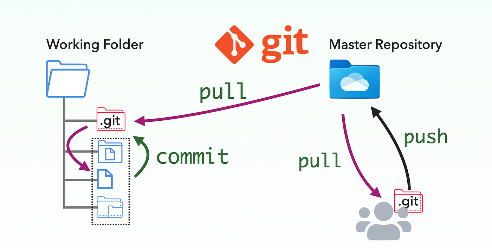

# GitHub
## …
## GitHub is a web-based platform that allows developers to store, share, and collaborate on code and other content
.webp)
# Version control
## GitHub uses the open-source version control software Git to allow multiple people to make changes to code at the same time. This helps avoid issues that can arise when multiple developers work on the same file or feature

> GitHub is a cloud-based platform where you can store, share, and work together with others to write code. Storing your code in a "repository" on GitHub allows you to: Showcase or share your work. Track and manage changes to your code over time.

## GitHub's revenue comes 50% from GitHub Enterprise which is offered as an on-premise or cloud service. All paying subscribers have access to unlimited public repositories, unlimited private repositories, 24×7 support team, and user permissions. The Enterprise plan also allows companies to keep their code private.

[Ссылка на сайт](https://github.com/)